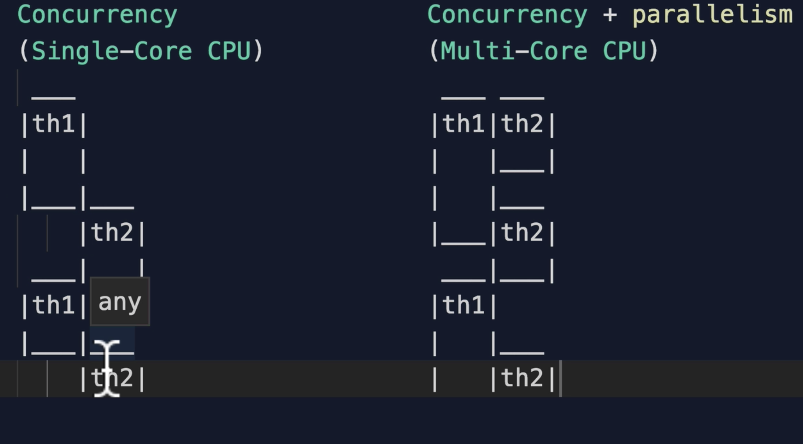

# Javascript Advanced - Udemy

## By [Andrei Neagoie](https://www.udemy.com/course/advanced-javascript-concepts/)

<h3 id='summary'>Summary</h3>

- [Javascript Advanced - Udemy](#javascript-advanced---udemy)
  - [By Andrei Neagoie](#by-andrei-neagoie)
    - [Javascript Engine](#javascript-engine)
        - [Interpreters X Compilers](#interpreters-x-compilers)
        - [Writing Optimized Code](#writing-optimized-code)
        - [Call Stack and Memory Heap](#call-stack-and-memory-heap)
        - [Garbage Collection](#garbage-collection)
        - [Single Threaded language](#single-threaded-language)
    - [Execution context](#execution-context)
        - [Lexical Environment](#lexical-environment)
        - [Hoisting](#hoisting)
    - [Function Call](#function-call)
        - [Variable/Local Environment](#variablelocal-environment)
    - [Function vs Block Scope](#function-vs-block-scope)
    - [IIFE (Immediately Invoked Function Expression)](#iife-immediately-invoked-function-expression)
    - [This](#this)
          - [Bind, Apply, Call](#bind-apply-call)
          - [Currying and Bind](#currying-and-bind)
        - [Scope vs Context](#scope-vs-context)
    - [JS Types](#js-types)
        - [Pass By Value vs Pass By Reference](#pass-by-value-vs-pass-by-reference)
        - [Type Coercion](#type-coercion)
        - [Dynamic vs Static and Strong vs Weak Languages](#dynamic-vs-static-and-strong-vs-weak-languages)
    - [Functions vs Objects](#functions-vs-objects)
      - [Higher Order Functions](#higher-order-functions)
    - [Closures](#closures)
          - [Memory Efficiency from closures](#memory-efficiency-from-closures)
          - [Encapsulation](#encapsulation)
    - [Prototypal Inheritance](#prototypal-inheritance)
    - [OOP - Object Oriented Programming](#oop---object-oriented-programming)
      - [This within Classes](#this-within-classes)
      - [Inheritance](#inheritance)
      - [Private vs Public](#private-vs-public)
      - [4 Pillars of OOP](#4-pillars-of-oop)
    - [FP (Functional Programming)](#fp-functional-programming)
      - [Pure Functions](#pure-functions)
      - [Idempotence](#idempotence)
      - [Imperative vs Declarative](#imperative-vs-declarative)
      - [Immutability](#immutability)
      - [Higher Order Functions and Closure Review](#higher-order-functions-and-closure-review)
      - [Currying](#currying)
      - [Partial Application](#partial-application)
      - [Memoization / Caching](#memoization--caching)
      - [Compose and Pipe](#compose-and-pipe)
      - [Arity](#arity)
    - [Composition vs inheritance](#composition-vs-inheritance)
      - [OOP vs FP](#oop-vs-fp)
    - [Asynchronous JS](#asynchronous-js)
      - [How JS Works](#how-js-works)
      - [Callbacks](#callbacks)
      - [Promises](#promises)
      - [Async and Await (ES8)](#async-and-await-es8)
      - [ES9 (2018)](#es9-2018)
      - [Job Queue / Microtask Queue](#job-queue--microtask-queue)
      - [Parallel, Sequence, and Race](#parallel-sequence-and-race)
      - [Promise.allSettled - ES2020)](#promiseallsettled---es2020)
      - [Promise.any() - ES2021](#promiseany---es2021)
      - [Threads, Concurrency, and Parallelism](#threads-concurrency-and-parallelism)
    - [Modules in JS](#modules-in-js)
      - [Module Pattern](#module-pattern)
      - [CommonJS, AMD, and UMD](#commonjs-amd-and-umd)
      - [Native Module - ES6](#native-module---es6)
    - [Error Handling](#error-handling)
      - [Extending Errors](#extending-errors)
  - [Intermediate JS](#intermediate-js)
    - [ES5 & ES6](#es5--es6)
      - [Let and Const](#let-and-const)
      - [Advanced Arrays](#advanced-arrays)
      - [Advanced objects](#advanced-objects)
    - [ES7(2016)](#es72016)
    - [ES8(2017)](#es82017)
    - [ES8 and ES9(2018)](#es8-and-es92018)
    - [ES10(2019)](#es102019)
    - [Advanced Loops](#advanced-loops)
    - [ES2020](#es2020)
    - [ES2021](#es2021)
    - [Debugging](#debugging)
    - [Modules](#modules)

### Javascript Engine

[Summary](#summary)

The JS Engine translate the javascript to computer language.

There are tons of [ECMAScript engines](https://en.wikipedia.org/wiki/List_of_ECMAScript_engines). Ex. V8, Chakra, Tamarin.

The very first JS Engine was created by Brendan Eich (spider monkey JS engine - still used by firefox). He is also the creator of JavaScript.


ECMAScript is the governing body of JS, and decides how the language should be standardized.

##### Interpreters X Compilers

[Summary](#summary)

Within the **Interpreter** we read and translate the file line by line on the fly.

**Compilers** work ahead of time to create a translation of the code and it compiles down into a language that can be read by the machine.

You can run JS using any of the two.
Interpreters are quick to get on and running. It runs right away. It's best for JS because we don't want the user to wait. The problem with interpreter is that if you are within a loop, it can get really slow.
On these cases, the compiler is best, it takes longer to start, but simplify the code replacing it with an optimized one.

JIT Compiler (Just in Time Compiler) is the mix of interpreters and compilers. That is exactly what V8 does. If you look at the image above, that's how V8 works:

1. Parse the code (_lexical analysis_ of the code, breaking it into _tokens_ to identify what the code is trying to do)
2. AST - separate the code (tokens are formed into an _abstract syntax tree_)
   [AST Explorer](https://astexplorer.net/)
3. Runs the Interpreter and returns _Bytecode_
4. The Profiler (aka Monitor) will monitor our code and when it finds code that can be optimized will send it to the Compiler
5. The Compiler will compile and optimize the code

```
Note: Babel is a Javascript compiler that takes your modern JS code and returns  browser compatible JS (older JS code).
Typescript is a superset of Javascript that compiles down to Javascript.
Both of these do exactly what compilers do: Take one language and convert into a different one!
```

**Is JS an interpreted language?** Initially yes, but nowadays we also have compilers and it depends on which engine you are using, in other words, on the implementation of the JS code. We can have JS code that uses only a compiler, so in this case, the code is not and interpreted language. This is also truth with Python, since Python can use an Interpreter or a Compiler.

##### Writing Optimized Code

[Summary](#summary)

In order to help the JS Engine we should be careful with:

-   eval()
-   arguments
-   for in loop
-   with
-   delete
-   Hidden Classes
-   Inline Caching -

```javascript
const userData = {
	firstName: "John",
	lastName: "Doe",
};

function findUser(user) {
	return `found ${user.firstName} ${user.lastName}`;
}

findUser(userData);

// Inline Caching - will cache findUser to be the string `found John Doe`, so it will not have to run over and over again

function Animal(x, y) {
	this.x = x;
	this.y = y;
}

const obj1 = new Animal(1, 2);
const obj2 = new Animal(3, 4);

obj1.a = 30;
obj1.b = 100;
obj2.b = 30;
obj2.a = 100;

// Hidden Classes - the above code will make the compiler run slower. So to avoid this issue, make sure you add things in the same order or you add the things in the constructor. And that's why the delete is also problematic.
```

WebAssembly (Standard Binary Executable Format) is an executable format that all major browsers agrees on. So it runs really fast on the browser instead of having to go through that entire JS engine process.

##### Call Stack and Memory Heap

[Summary](#summary)

We need the Memory Heap as a place to store information. Where the memory allocation happens.
We use the call stack as a way to keep track where we are on the code, so we can run the code in order. Where the engine keeps track of where your code is in its execution.

Stack Overflow happens when the call stack size is exceeded.

##### Garbage Collection

[Summary](#summary)

JS is a garbage collected language. In other words, when JS realize we are not using the data, the garbage collector will free up the memory.

Memory Leaks happen when we forget to clean up the code and the garbage collector don't reach that specific code in order to free it up. The most common ways this happens:

-   Global Variables
-   Event Listeners - you add new ones and never clean up when you don't need anymore
-   SetTimeout and SetInterval - the objects inside them are never going to get collected

##### Single Threaded language

[Summary](#summary)

JS is a single thread language, so the code runs line by line. And because of that JS is synchronous.

[The JS Runtime](https://www.youtube.com/watch?v=8aGhZQkoFbQ&feature=emb_title)

[JS Runtime Playground](http://latentflip.com/loupe/?code=ZnVuY3Rpb24gcHJpbnRIZWxsbygpIHsNCiAgICBjb25zb2xlLmxvZygnSGVsbG8gZnJvbSBiYXonKTsNCn0NCg0KZnVuY3Rpb24gYmF6KCkgew0KICAgIHNldFRpbWVvdXQocHJpbnRIZWxsbywgMzAwMCk7DQp9DQoNCmZ1bmN0aW9uIGJhcigpIHsNCiAgICBiYXooKTsNCn0NCg0KZnVuY3Rpb24gZm9vKCkgew0KICAgIGJhcigpOw0KfQ0KDQpmb28oKTs%3D!!!PGJ1dHRvbj5DbGljayBtZSE8L2J1dHRvbj4%3D)

NodeJs is a JS runtime built on V8 JS Engine. It was created to run JS in the computer, so you don't need to run in the browser. It makes JS non-blocking because it sends the code to the event loop that is running on the background.

### Execution context

[Summary](#summary)

Every time we run JS code it is run inside and Execution Context.

On the first phase, the Global Execution Context give us a`Global Object` and the `this`. And they are equal to one another initially. In this phase, we also have `hoisting`.

On the second phase, a new Execution Context is created to run our code.

##### Lexical Environment

[Summary](#summary)

It means where is the code written? Ex.

```javascript
function hi() {
	return "Hi";
}

function sayHi() {
	function inside() {
		return "I am inside!";
	}
	return hi();
}

function bePolite() {
	return sayHi();
}

bePolite();

// In this example we can see that functions: hi, sayHi, and bePolite, were written in the global environment. While function inside was written within the sayHi environment.
```

Think about little worlds (each function), where each world is a lexical environment.


In JS, our lexical scope/environment (available data + variables where the function was defined) determines our available variables. Not where the function is called (dynamic scope).

The very first lexical environment that we have is the global environment.

##### Hoisting

[Summary](#summary)

Is the behavior of moving the functions declarations/variables to the top of their respective environments during compilation phase. Variables are partially hoisted (we hoist the variables defined with **var** \* but assign undefined) and function declarations are hoisted.

_\* variables and functions defined with **let** or **const** are not hoisted._

Interesting Example:

```javascript
// hoisted:
// var favoriteFood = undefined;
// var foodThoughts = undefined;

var favoriteFood = "grapes";

var foodThoughts = function () {
	//hoisted:
	// var favoriteFood = undefined

	console.log("Original favorite food: " + favoriteFood);

	var favoriteFood = "sushi";

	console.log("New favorite food: " + favoriteFood);
};

// logs:
// Original favorite food: undefined
// New favorite food: sushi
// undefined            * because the function doesn't have a return statement
```

### Function Call

[Summary](#summary)

Function declaration: `function x() {...}`
Function Expression: `const x = () => {}`

Function Invocation/Call/Execution - just run the function and creates an execution context with:

-   `this`
-   `arguments`

The `arguments` keyword is a special keyword in JS.

```javascript
const marry = (p1, p2) => {
	console.log("arguments: " + arguments);
	return `${p1} married ${p2}!`;
};

marry("John", "Jane");
// arguments: {0: 'John', 1: 'Jane'}
// John married Jane!
```

Within the Function Execution Context, we also have the Variable/Local Environment.

##### Variable/Local Environment

[Summary](#summary)

Is the local environment within an execution context. For example, the local environment within a function.

### Function vs Block Scope

[Summary](#summary)

Function scope is the lexical environment inside the function.

Block scope, on the other hand, is the lexical environment within a block of code with `{}`.

In JS, you can create the block scope using `const` and `let` for variable declaration.

### IIFE (Immediately Invoked Function Expression)

[Summary](#summary)

An IIFE is a anonymous function expression that is immediately invoked after being created.

```javascript
(function () {
	// do something
})();
```

So, why use IIFE? It will create a new execution environment, so you won't have a problem with scope and will minimize the amount of data that we add to the global environment.

### This

[Summary](#summary)

`this` is the object that the function is a property of.

In the global object, `this` is the global object. Ex. in the browser it is the `window`.

If we have a function in the global object, `this` will still be the global object. Ex. `function a() {console.log(this)}`

If you use `use strict` the `this` inside the function will be undefined.

`this` within an object, will be the object.

`this` is what is left to the dot.

```javascript
const myObj = {
    name: 'Suzy',
    sing() {
        return 'alalala ' + this.name
    }
    singAgain() {
        return this.sing() = '!'
    }
}

myObj.sing()    // alalala Suzy
```

So, `this` has 2 main benefits:

-   gives methods access to their object (example above)
-   execute same code for multiple objects (example below)

```javascript
const importantPerson = () => {
	console.log(this.name + "!");
};

importantPerson(); // == window.importantPerson() ==> this is window

const name = "Sunny";
const obj1 = {
	name: "Suzy",
	importantPerson: importantPerson,
};

const obj2 = {
	name: "Pedro",
	importantPerson: importantPerson,
};

importantPerson(); // Sunny!
obj1.importantPerson(); // Suzy!
obj2.importantPerson(); // Pedro!

// Another example
const a = () => {
	console.log("a", this);
	const b = () => {
		console.log("b", this);
		const c = {
			hi: () => console.log("c", this),
		};
		c.hi();
	};
	b();
};

a();
// a window     ==> window.a()
// b window     ==> window.a(b())
// c {hi: f}    ==> c.hi()
```

Within an object, always use arrow function to bind this to the object. On the old days, we used to use `.bind(this)` to do this biding. We could also create a variable (self) and define it as `this`. Then use the self variable, instead of `this`.

###### Bind, Apply, Call

[Summary](#summary)

`call` and `apply` do the same thing, it just calls the function. The only difference it that, when passing parameters, `apply` takes an array, instead of just parameters.

`bind` binds the this keyword to the object and allows us to store the function for a later use.

```javascript
const wizard = {
	name: "Merlin",
	health: 50,
	heal(num1 = 50, num2 = 50) {
		return (this.health = num1 + num2);
	},
};

const archer = {
	name: "Robin Hood",
	health: 30,
};

console.log("1", archer.health); //1 30
wizard.heal(); // 100
wizard.heal.call(archer);
console.log("2", archer.health); //2 100
wizard.heal.call(archer, 45, 35);
console.log("3", archer.health); //3 80

wizard.heal.apply(archer, [45, 35]);

const healArcher = wizard.heal.bind(archer, 45, 35);
healArcher(); // 80
```

###### Currying and Bind

[Summary](#summary)

Refers to only partially getting a parameter to a function and save it to use later.

```javascript
const multiply = (a, b) => a * b;

let multiplyBy2 = multiply.bind(this, 2);

console.log(multiplyBy2(4)); // 8
```

##### Scope vs Context

[Summary](#summary)

Scope is a function base thing, what is the variable access when it is invoked. Where is the variable environment. It's about the visibility of variables.
Context is about the object. What is the value of the `this` keyword. Usually determined by how is the function invoked with the value of `this`.

### JS Types

[Summary](#summary)

1. Number
2. Boolean
3. String
4. Undefined
5. Null
6. Symbol('just me')
7. Object
    1. Array - to check if variable is an array use: `Array.isArray(variable)`
    2. Function

##### Pass By Value vs Pass By Reference

[Summary](#summary)

Primitive types are immutable. Ex. `let a = 10`

Objects are pass by reference. They pass the reference in memory from that object.

To create copies of objects without using the reference:

```javascript
let obj = { a: "a", b: "b" };
let clone = Object.assign({}, obj);
let clone2 = { ...obj };

obj.b = 5;
console.log(obj); // {a:'a', b:5}
console.log(clone); // {a:'a', b:'b'}
console.log(clone2); // {a:'a', b:'b'}
```

NOTE: these options above are only shallow clones. If you have ??, you should do a deep clone, you can do that using JSON or a library. Be careful with deep cloning because it can take a long time.

```javascript
let obj = { a: "a", b: "b", c: { deep: "hahaha" } };
let clone = Object.assign({}, obj);
let clone2 = { ...obj };
clone.c.deep = "different";

let superClone = JSON.parse(JSON.stringify(obj));

obj.b = 5;
console.log(obj); // {a:'a', b:5, c: {deep: 'different'}}
console.log(clone); // {a:'a', b:'b', c: {deep: 'different'}}
console.log(clone2); // {a:'a', b:'b', c: {deep: 'different'}}
```

Exercise: How would you compare two objects if they are pointing to a different location in memory but still have the same properties?

```javascript
var user1 = { name: "nerd", org: "dev" };
var user2 = { name: "nerd", org: "dev" };

var eq = user1 == user2;
console.log(eq); // gives false

// the below only works if the properties are in order
var eq1 = JSON.stringify(obj1) === JSON.stringify(obj2);
console.log(eq1); // gives true
```

##### Type Coercion

[Summary](#summary)

Means the language converting the variable from one type to another.

[JS Equality Table](https://dorey.github.io/JavaScript-Equality-Table/)
[mdn](https://developer.mozilla.org/en-US/docs/Web/JavaScript/Equality_comparisons_and_sameness)

##### Dynamic vs Static and Strong vs Weak Languages

[Summary](#summary)


**Dynamic** typed language allows us not to declare the type of variable. Ex. `let a = 100;`

**Static** languages forces us to declare the type of the variable. `let a: number = 100;`

**Weak** language is a language that has type coercion. So, for example, if we are using JS and try to add a string to a number, it will transform the number into a string and add to the end of the original string.

**Strong** languages don't allow coercion. So in python, for example, if you try the same as the example above, it will return a error.

### Functions vs Objects

[Summary](#summary)

Arrays and Functions in JS are objects. Functions are special objects, they are callable objects. When we invoke a function we get 2 parameters (`this` and `arguments`).

Ways to invoke a function:

-   call it as a regular function
-   as a method - function inside of an object
-   use call and apply

```javascript
function a() {...}
a();            // call it

const obj = {
    // two: function() { return 2 }
    // or
    two() { return 2 }
};

ob.two();       // method

a.call();       //with call and apply

const four = new Function('return 4');
four();         // create a function with a function constructor

// we can also pass parameters to the function constructor:
const returnNumPlusFive = new Function('num', 'return num + 5')
returnNumPlusFive(4);
```

When we create a function, on the background a callable object is created, not exactly like this, but the same idea:

```javascript
function talk() {
    console.log('Hi');
};

talk.yell = 'ahhhhhhh';

// background:
const specialObj = {
    yell: 'ahhhhhhh',
    name: 'talk',
    (): console.log('Hi'),
    arguments: [],
    this: ....,
    call: ....
}
```

**Functions are first class citizens in JS**. This means 3 things:

-   functions can be assigned to variables and object properties
-   functions can be passed as parameter to another function
-   we can return functions as values from other functions

#### Higher Order Functions

[Summary](#summary)

Higher Order Functions are either functions that accepts another function as a parameter or returns another function.

Ex:

```javascript
function authenticate(validate) {
	let adminArr = [500, 600, 700, 800];
	let userArr = [100, 200, 300, 400];
	return adminArr.includes(validate) || userArr.includes(validate);
}

function giveAccess(name) {
	return `${name} is authenticated`;
}

function login(person, fn) {
	return fn(person.level)
		? giveAccess(person.name)
		: "This person is not authorized";
}

login({ level: 300, name: "Tom" }, authenticate);
```

With HOF we are able to reuse code more easily.

Ex1:

```javascript
const multiplyBy = num1 => num2 => num1 * num2;
const multiplyByTwo = multiplyBy(2);
multiplyByTwo(4);
multiplyByTwo(10);
multiplyBy(3)(5);
```

### Closures

[Summary](#summary)

Is the combination of function and the lexical scope (variable environment) on which it was declared. Closures allow a function to access variables from an inclosing scope/environment even after it leave the scope on which it was declared.

Ex:

```javascript
function a() {
	let grandpa = "grandpa";
	return function b() {
		let father = "father";
		return function c() {
			let son = "son";
			return `${grandpa} > ${father} > ${son}`;
		};
	};
}

a(); // return function b
a()()(); // return `grandpa > father > son`
```

So with a closure, when we run the a function first, it is pushed onto the stack and a variable environment, and this context execution had grandpa as a variable.
Once it is removed from the stack, everything is done, except the grandpa variable, that is put into the closure 'box' (memory heap). However when the garbage collections comes, it sees that grandpa is within the closure box and it cannot be removed because it is being referenced by another function inside of it. The same happens to the function b. And when we finally call the c function, it will look into the closure 'box' first, before going to global scope.

Where we write functions matters.

Ex2. Very interesting one because we define the variable after the return function:

```javascript
function callMe() {
	setTimeout(() => console.log(ring), 4000);
	const ring = "ring, ring! ring, ring!";
}

callMe(); // it will log 'ring, ring! ring, ring!'
```

Note. we set a timeout, so the return function with be put on the callback queue, and when it is put back on the stack, the `ring` variable has already been created and assigned.

Closures have 2 main benefits:

-   memory efficient
-   encapsulation

###### Memory Efficiency from closures

[Summary](#summary)

```javascript
function heavyDuty(idx) {
	const bigArr = new Array(7000).fill("ok");
	console.log("Created!");
	return bigArr[idx];
}

heavyDuty(7);
heavyDuty(7);
heavyDuty(7);
heavyDuty(7);

// every time I call the above function the bigArr will be created and destroyed over and over again. With closures we can save the bigArr and return the function that we will call over and over.

function betterHeavyDuty() {
	const bigArr = new Array(7000).fill("ok");
	console.log("Created!");
	return function (idx) {
		return bigArr[idx];
	};
}

betterHeavyDuty()(7);
betterHeavyDuty()(7);
betterHeavyDuty()(7);
betterHeavyDuty()(7);
```

###### Encapsulation

With closures we are able to encapsulate the data and expose only what we want.

[Summary](#summary)

```javascript
const makeBombBtn = () => {
	let timeToDestroy = 0;
	const passTime = () => timeToDestroy++;
	const totalPeaceTime = () => timeToDestroy;
	const launch = () => {
		timeToDestroy = -1;
		return "Buuuuummmm!";
	};
	setInterval(passTime, 1000);
	return {
		// launch,
		totalPeaceTime,
	};
};

const ohNo = makeBombBtn();
ohNo.totalPeaceTime();
// ohNo.launch();

// if I do not expose the launch, no one will be able to use this function, they only have access to totalPeaceTime.
```

Exercise: fix teh below function to log the proper `i` number. Right now it will log 4 times 'I am at index 4'.

```javascript
const arr = [1, 2, 3, 4];
for (var i = 0; i < arr.length; i++) {
	setTimeout(() => console.log(`I am at index ${arr[i]}`), 3000);
}
```

the easiest way, change var to let (block scope), so each `i` will be scoped and saved for its own closure function.

```javascript
const arr = [1, 2, 3, 4];
for (let i = 0; i < arr.length; i++) {
	setTimeout(() => console.log(`I am at index ${arr[i]}`), 3000);
}
```

another way: we create a IIFE and pass the `i` to it, so it will save it.

```javascript
const arr = [1, 2, 3, 4];
for (var i = 0; i < arr.length; i++) {
	(function (closureI) {
		setTimeout(() => console.log(`I am at index ${arr[closureI]}`), 3000);
	})(i);
}
```

### Prototypal Inheritance

[Summary](#summary)

Inheritance is an object getting access to the properties and methods of another object.

Ex.

```javascript
const arr = [];

arr.__proto__; // goes to the Array prototype
arr.__proto__.__proto__; // goes even upper on the chain and shows us the base Object that everything in JS inherits from
```

```javascript
let dragon = {
	name: "T",
	fire: true,
	fight() {
		return 5;
	},
	sing() {
		if (this.fire) `I am ${this.name}, the breather of fire.`;
		else `I am ${this.name}.`;
	},
};

let lizard = {
	name: "K",
	fight() {
		return 1;
	},
};

// let singerLizard = dragon.sing.bind(lizard);
// console.log(singerLizard());         // I am K.

// creating the prototype chain
lizard.__proto__ = dragon;
lizard.fire; // true
lizard.sing(); // I am K, the breather of fire.
lizard.fight(); // 1

lizard.isPrototypeOf(dragon); // true

for (let prop in lizard) {
	console.log(prop);
} // name, fire, fight, sing

for (let prop in lizard) {
	if (lizard.hasOwnProperty(prop)) {
		console.log(prop);
	}
} // name and fight
```

Note: You should NEVER use the `__proto__` method like that. We never want to manually assign like that.

Prototypal Inheritance is useful because you can have objects with properties that point to the same place in memory, thus being more efficient.

At the end of the chain we get a `null`.

The `__proto__` links to the up the chain `prototype` object.

```javascript
function a() {}

a.__proto__; // is the same of line below because proto
Function.prototype; // points to the prototype up the chain
```

How to create the prototypal inheritance the right way:

```javascript
let human = {
	mortal: true,
};
let socrates = Object.create(human);
socrates.age = 45;
console.log(socrates.age); // 45
console.log(socrates.mortal); // true
console.log(human.isPrototypeOf(socrates)); // true
```

We need to use `Object.create(<object to inherit from>)`.

Only functions have the prototype property and it references to an object used to attach properties that will be inherited by objects further down the prototype chain. The last object from the chain is the built-id `Object.prototype`. `Object` is a function. But the `Object.prototype` is an object, it is what we call the `base object`.

All the built-in methods are functions with the prototype object within them.

```javascript
typeof Object; // function
typeof Object.prototype; // object
const obj = {};
typeof obj; // object
console.log(obj.prototype); // undefined
function a() {}
typeof a; // function
console.log(a.prototype); // Exists, it will show the prototype object

//Exercise - extend the functionality of a built in object

//#1
//Date object => to have new method .lastYear() which shows you last year 'YYYY' format.

Date.prototype.lastYear = function () {
	return this.getFullYear() - 1;
}; // cannot use arrow functions because of the lexical scope

new Date("1900-10-10").lastYear();
//'1899'
new Date().lastYear();
// '2020'

//#Bonus
// Mofify .map() to print '🗺' at the end of each item.
Array.prototype.map = function () {
	let arr = [];
	for (let i = 0; i < this.length; i++) {
		arr.push(this[i] + "🗺");
	}
	return arr;
};
console.log([1, 2, 3].map());
//1🗺, 2🗺, 3🗺
```

When JS was created, both creators were inspired by 2 languages: `Scheme` and `Java`. Java is an OOP, while Scheme had the idea of closures, ending up to be quite functional. That is why JS can be an OOP or a FP. It really depends of what you want for your program to be.

### OOP - Object Oriented Programming

[Summary](#summary)

OOP and FP are paradigms. They make code clear and understandable, easy to extend, easy to maintain, memory efficient and keep the code dry.

**OOP (Object Oriented Programming)** - separate the program into separate objects with everything related to that part in there, data, logic etc. Like boxes. Ex. building a robot, we hade a box for the head, a box for the arm, a box for the leg, etc.

Note. With ES6 the keyword Class finally arrived in JS. However, keep in mind this is not a real Class, it is a syntactic sugar because under the hood JS is still using prototypal inheritance. Some people call this "pseudo classical inheritance".

#### This within Classes

[Summary](#summary)

4 ways of using `this`:

1. New way of binding

```javascript
function Person(name, age) {
	this.name = name;
	this.age = age;
}
const person1 = new Person("bob", 30);
```

2. Implicit binding
   When the `this` keyword inside an object refers to the object.

```javascript
const person2 = {
	name: "Karen",
	age: 40,
	hi() {
		console.log(`Hi, my name is ${this.name}.`);
	},
};
```

3. Explicit binding
   When we explicitly dictate what the `this` keyword should refer to. Is using `bind`, `call`, or `apply`.

```javascript
const person3 = {
    name: 'Karen',
    age: 40,
    hi() {
        console.log('Hi.' + this.setTimeout)
    }.bind(window)
}
```

4. Arrow functions
   With the arrow function if we use `this` keyword we will be doing lexical scope. So wherever we write the function that's what `this` binds to.

```javascript
const person4 = {
	name: "Karen",
	age: 40,
	hi: function () {
		const inner = () => {
			console.log(`Hi, my name is ${this.name}.`);
		};
		return inner();
	},
};

person4.hi(); // Hi, my name is Karen
```

In this case, if we didn't use the arrow function, `this` would be the window object, which is not what we expect.

#### Inheritance

[Summary](#summary)

It means passing knowledge down. It just doesn't copy the code to the subclasses, it makes the subclasses extend the superclass.

Use `extends` keyword and `super()` to inherit the constructor.

Check OOP.js.

#### Private vs Public

[Summary](#summary)

In ES2020 the `#` was introduced to JS. Before that, what developers used to use was adding `_` in front of the variable, so other developers would know that was private to the class and should not be called anywhere. However `_` doesn't really make it private, if you wanted you could still use it.

Now we can finally use `#` for that!

Ex. `#privateMethod() {...}`

#### 4 Pillars of OOP

[Summary](#summary)

So, summarizing the 4 pillars of OOP are:

1. **Encapsulation** - before this, we had procedural programming, now with encapsulation, we wrap code into boxes that are related to one another. It makes code easier to maintain and more useable.
2. **Abstraction** - hiding the complexity from the user, creating simple interfaces. I'll take care of the class and all you need to do is instantiate it. It comes will everything you need.
3. **Inheritance** - by inheriting from other classes we avoid having to re-write the same code, and we also save memory space by having shared methods.
4. **Polymorphism** - (many forms) The idea is having the ability to call the same method in different objects and each one responding in a different way. For ex. when we override a method with its own form in the subclass:

```javascript
// superclass or base class
class Character {
	constructor(name, weapon) {
		this.name = name;
		this.weapon = weapon;
	}

	attack() {
		return `attack with ${this.weapon}`;
	}

	#privateMethod() {
		return `this is a private method!`;
	}
}

// subclass - use super() to call the superclass constructor
class Elf extends Character {
	constructor(name, weapon, type) {
		super(name, weapon);
		this.type = type;
	}
	attack(cry) {
		return `attack with ${cry}`;
	}
}

const dolby = new Elf("Dolby", "cloth", "house");
dolby.attack("weee"); // attack with weee
```

Or we could do method overloading, which is adding a feature/parameters to the superclass method. Ex.

```javascript
class Character {
	constructor(name, weapon) {
		this.name = name;
		this.weapon = weapon;
	}

	attack(cry) {
		return `attack with ${this.weapon} and ${cry}`;
	}
}

class Elf extends Character {
	constructor(name, weapon, type) {
		super(name, weapon);
		this.type = type;
	}
	attack(cry) {
		return super.attack(cry);
	}
}

const dolby = new Elf("Dolby", "cloth", "house");
dolby.attack("weee"); // attack with cloth and weee
```

Please check OOP javascript file.

Factory Functions create objects programatically.

### FP (Functional Programming)

[Summary](#summary)

Data and behavior are distinct and should be kept separate.

Is all about separation of concerns. It's all about packaging our code into separate chunks.

But it also separate data and functions.

It is usually based on simplicity.

Functions operates in data structures, instead of belonging into the data structure. Ex. function operates in array, instead of being a method of an object.

The goals of FP are the same as OOP:

1. Make our code Clear and Understandable
2. Easy to Extend
3. Easy to Maintain
4. Keep our Memory Efficient by having reusable functions
5. Keep the code DRY

**Pure Functions** - separation of data and behavior of program. And all objects are immutable. We avoid things like shared state.

#### Pure Functions

[Summary](#summary)

2 Main things:

1. a function has to always return the same output given the same input
2. a function cannot modify anything outside of itself - no side effects

Note. the following is not a pure function because it is modifying something outside, in this case the window object, and it has side effects.

```javascript
function a() {
	console.log("hi");
}
```

**Referential Transparency** means, if I change the function for its result, in this case for 5, it will not have any effect to the program. So, no matter the input, if they are the same, the output will be the same.

```javascript
function b(n1, n2) {
	return n1 + n2;
}
b(2, 3); // always 5

function c(n) {
	return n * 2;
}
c(b(2, 3)); // is the same as c(5)
```


#### Idempotence

[Summary](#summary)

The function always does/returns what we expect it to do. It's a little bit different from pure functions because `console.log` would still be a idempotent function.

Another example is the API get request, with the same parameters it will always return the same result.

It is very important because it makes our code predictable.

Another important thing is the idea that even if we call the same function over and over inside itself, it will always return the same result. Ex. `Math.abs(Math.abs(-50))`

#### Imperative vs Declarative

[Summary](#summary)

**Imperative** code is the code that tells the machine WHAT to do and HOW to do it. Great example are `for loops`. Declare variable i, it will start at 0 and go until 99 and increment by 1 every time and for each item console.log it. Another example is jQuery.

**Declarative** code is the code that tells the machine WHAT to do and WHAT should happen. Here the code doesn't say HOW to do it. Great example here is a `forEach loop`. We give the array, for each item console.log it. Another example is React.

```javascript
// Imperative - for loop
for (let i = 0; i < 100; i++) {
	console.log(i);
}

// Declarative - forEach loop
[1, 2, 3].forEach(i => console.log(i));
```

#### Immutability

[Summary](#summary)

Means not changing the data, the state.

Ex.

```javascript
const obj = { name: "Bob" };
function clone(obj) {
	return { ...obj };
}

function updateName(obj) {
	const obj2 = clone(obj);
	obj2.name = "Nana";
	return obj2;
}

updateName(obj);
console.log(obj); // initial object is the same
```

**Structural Sharing** is the idea that we don't copy everything, what happens is that only the changes will be copied. So it doesn't fill up the whole memory.

#### Higher Order Functions and Closure Review

[Summary](#summary)

**HOF** is a function that either takes function as arguments or return a function, like a callback. Is the idea that functions are **first citizens** in JS. Example:

```javascript
const hof = fn => fn(5);
hof(function a(x) {
	return x;
});
```

**Closure** mechanism for containing some sort of state. Define a function inside another function and expose it so we can use that variable. Example:

```javascript
const closure = function () {
	let count = 0;
	return function increment() {
		count++;
		return count;
	};
};
const incrementFn = closure();
incrementFn(); // 1
incrementFn(); // 2
incrementFn(); // 3
```

So because we created a closure, even if the previous call has already finished, the function will remember that variable for the next time it is called.

For FP closures can be used, as long as we don't modify/mutate the data (variable). We are able to use closures to create private variables. Ex:

```javascript
const closure = function () {
	let count = 50;
	return function getCounter() {
		return count;
	};
};
const getCounter = closure();
getCounter(); // 55
getCounter(); // 55
getCounter(); // 55
```

#### Currying

[Summary](#summary)

Technique of translating the evaluation of a function that takes multiple arguments into evaluating a sequence of functions, each with a single argument. In other words, you take a function that can take multiple parameters, and instead using curry you modify it into a function that take only one parameter at a time.

Ex.

```javascript
const multiply = (a, b) => a * b;
multiply(3, 5); // 15

// currying
const curryMultiply = a => b => a * b;
curryMultiply(3)(5); // 15

const curryMultiplyBy5 = curryMultiply(5);
curryMultiplyBy5(4); // 20
```

#### Partial Application

[Summary](#summary)

Way for us to partially apply a function. Process of producing a function with a smaller number of parameters. It means taking a function applying some of its arguments into the function so it remembers those parameters and then it uses closures to later on be called with all the rest of the arguments.

Ex.

```javascript
const multiply = (a, b, c) => a * b * c;
const curriedMultiply = a => b => c => a * b * c;
const partiallyApplicationMultiplyBy5 = multiply.bind(null, 5);
partiallyApplicationMultiplyBy5(4, 10); // 200
```

The difference between currying and partial application is that curry expects 1 argument at a time, while partial application can receive more than one.

#### Memoization / Caching

[Summary](#summary)

Caching is a way to store values so you can use them later one. Ex. caching is like a backpack, so instead of going all the way back from school when you need a pencil, just reach out to your backpack.

Ex.

```javascript
const addTo80 = n => {
	console.log("long time");
	return n + 80;
};

addTo80(5); // long time - 85
addTo80(5); // long time - 85
addTo80(5); // long time - 85

let cache = {};
const memoizedAddTo80 = n => {
	if (n in cache) return cache[n];
	console.log("long time");
	cache[n] = n + 80;
	return cache[n];
};

memoizedAddTo80(5); // long time - 85
memoizedAddTo80(5); // 85
```

So, **memoization** is a specific type of caching that involves caching tha return value of a function that is the return value of this function based on its parameters. In other words, is using caching to save the result of a function and if the function runs with the same parameter, it won't have to calculate again, it will just return the cached result.

Let's improve the above function a little bit, because we don't want to pollute the global scope, so we will use closures for it.

```javascript
const memoizedAddTo80 = () => {
	let cache = {};
	return function (n) {
		if (n in cache) return cache[n];
		console.log("long time");
		cache[n] = n + 80;
		return cache[n];
	};
};

const memoized = memoizedAddTo80();

memoized(5); // long time - 85
memoized(5); // 85
```

#### Compose and Pipe

[Summary](#summary)

**Composition** is the idea that any data transformation that we do should be obvious. Composability is a system design simple. We should create an assembly line: `data --> fn --> data --> fc --> data`

Note. `compose()` doesn't exist in JS yet. But there are a bunch of libraries that has it. One of the best libs to use for FP in JS is [Ramda](https://ramdajs.com/).

Ex.

```javascript
const compose = (f, g) => num => f(g(num));

const multiplyBy3 = num => num * 3;

const makePositive = num => Math.abs(num);

const multiplyBy3AndAbsolute = compose(multiplyBy3, makePositive);

multiplyBy3AndAbsolute(-50); // 150
```

**Pipe** is essentially the same thing, but instead of going right to left, it goes left to right.

```javascript
const pipe = (f, g) => num => g(f(num));
```

Explaining:

```javascript
f1(f2(f3(50)));
compose(f1, f2, f3)(50);
compose(f3, f2, f1)(50);
```

#### Arity

[Summary](#summary)

It means the number of arguments a function takes. Ex. the function that receives 2 arguments, had an arity of 2.

The less parameters/arity the better.

### Composition vs inheritance

[Summary](#summary)

**Composition** - what it has.

**Inheritance** - what it is. The main problems with inheritance are:

-   **Tight Coupling** between superclass and subclasses. So any small changes to the superclass will have a rippling effect to all subclasses.
-   **Fragile Base Class** comes from the tight coupling problem where the superclass becomes fragile to changes, since any small change can have major effects to subclasses
-   **Hierarchy** - classic gorilla/banana problem, where you just want a banana, but you get a gorilla holding a banana because of the inheritance. Another example is, imagine you create a game with a user class and then you have watcher and character subclasses, then elf subclass inherits from character. Then you want to create a jr elf class that inherits from elf class, but because of the hierarchy, you will receive all the methods the superclasses have, and the jr elf should only have 1 method, sleep.

To fix all these problems with composition, we need first to remove all the methods and create a composition of functions to add to the character object different abilities.

Example:

```javascript
const getAttackAbility = character =>
	Object.assign({}, character, { attack: () => `Attack!` });

const Elf = (name, weapon, type) => {
	let elf = { name, weapon, type };
	return getAttackAbility(elf);
};
```

#### OOP vs FP

[Summary](#summary)

**OOP**

-   few operations on common data
-   stateful - we modify state
-   side effects
-   imperative
-   Usage: many things, like characters in a game, with not too many operations

**FP**

-   many operations on fixed data
-   stateless
-   pure functions
-   declarative
-   Usage: good at processing large data for applications. High performance and processors.

### Asynchronous JS

[Summary](#summary)

Async means we don't have it right now, so we will request that.

#### How JS Works

[Summary](#summary)

Memory leak happens when we have variables/functions not being used but filling up the memory heap.

JS is a single threaded (only one call stack) language that can be non-blocking. So, in theory, JS is synchronous, it goes line by line.
Stack overflow is the problem when the call stack literally overflows. There are so many request in the stack that it fills it up.

Other languages, like C#, Java, or Go, are multi threaded which means they have multiple call stacks.

JS Run-Time Environment comes to save the day and help JS to have asynchronous functions.

[JS Runtime Env](images/js-runtime-env.png)

#### Callbacks

[Summary](#summary)

Callback is a function that will be called when something is done. This was a way to use JS async, so when something came back I could call another function.

The problem is the famous callback pyramid of doom. It's like an inceptions of callbacks inside callbacks. Ex.

```javascript
grabTweets('twitter/xyz', (err, xyzTweets) => {
    if (err) throw Error;
    displayTweets(xyzTweets)
    grabTweets('twitter/abc', (err, abcTweets) => {
        if (err) throw Error;
        displayTweets(abcTweets)
    }
    grabTweets('twitter/mno', (err, mnoTweets) => {
        if (err) throw Error;
        displayTweets(mnoTweets)
    }
}
```

Promises serve for the same purposes as callback, but they are more powerful.

#### Promises

[Summary](#summary)

Is an object that may produce a single value some time in the future, either a resolved value, or a reason that it's not resolved (rejected).

A promised can have 3 types of states:

-   Fulfilled
-   Rejected
-   Pending

Ex.

```javascript
const promise = new Promise((resolved, rejected) => {
	if (true) resolved("worked");
	rejected("error");
});

const promise2 = new Promise((resolved, rejected) => {
	setTimeout(resolved, 100, "Hi");
});

const promise3 = new Promise((resolved, rejected) => {
	setTimeout(resolved, 1000, "Oh");
});

const promise4 = new Promise((resolved, rejected) => {
	setTimeout(resolved, 5000, "Ok");
});

promise
	.then(result => result + "!")
	.then(result2 => result2 + "?")
	.catch(() => console.log("erroooor"))
	.then(result3 => console.log(result2 + "@")); // worked!?@

// to resolve all promises
Promise.all([promise, promise2, promise3, promise4]).then(values =>
	console.log(values)
); // waits for the 5 seconds to resolve all the promises and returns an array with the values - ['worked', 'hi', 'oh', 'ok']

/* Note. In order for the Promise.all test to work, you need to copy all and paste together in the console, otherwise, from the time you paste only the promises and then copy and paste the Promise.all, all the promises will be resolved already, so it won't take the 5 secs.
 */
```

#### Async and Await (ES8)

[Summary](#summary)

Built on top of promises. It makes the code easy to read. It makes asynchronous code look synchronous. It is syntactic sugar on top of promises. Example:

```javascript
async function playerStart() {
	const firstMove = await movePlayer(100, "left");
	await movePlayer(200, "up");
	await movePlayer(500, "right");
}
```

#### ES9 (2018)

[Summary](#summary)

**Object Spread Operator**

const animals = {
tiger: 2,
lion: 5,
monkey: 6
}

const {tiger, ...rest} = animals

**Finally** - allows us to do something "finally" when a promise is finished. No matter if there was successful (resolved) or if there was an error (rejected), finally will always run at the end. Note. finally doesn't receive any parameter.

```javascript
const myPromise = new promise((resolve, reject) => {
	setTimeout(resolve, 100, "Hi");
})
	.then(() => console.log("How are you?"))
	.catch(err => console.log(err))
	.finally(() => console.log("All done!"));
```

**For Await Of** - allows us to loop through over the await functions in case we have more than one.

```javascript
// for of
const loopThroughUrls = urls => {
	for (url of urls) {
		console.log(urls);
	}
};

// for await of
const getData = async urls => {
	try {
		const arrayOfPromises = urls.map(url => fetch(url));
		for await (let request of arrayOfPromises) {
			const data = await request.json();
			console.log(data);
		}
	} catch (err) {
		console.log(err);
	}
};
```

#### Job Queue / Microtask Queue

[Summary](#summary)

This is a smaller queue created for promises. And it has higher priority over the callback queue. So, the event loop will first look at the job queue and then look at the callback queue.


Because this is a browser implementation we might have some legacy browsers that implements this differently on don't even have this. So be careful.

#### Parallel, Sequence, and Race

[Summary](#summary)

3 ways we might want to run our promises.

-   Parallel - run in parallel, all the same time. Use `Promise.all()`.

```javascript
const parallel = async () => {
	const promises = [a(), b(), c()];
	const [res1, res2, res3] = await Promise.all(promises);
	return `parallel is done: ${res1} ${res2} ${res3}`;
};
parallel();
```

-   Sequencial - run in a sequence, so only runs the next when finish the previous. Use `await`.

```javascript
const sequence = async () => {
	const res1 = await a();
	const res2 = await b();
	const res3 = await c();
	return `sequence is done ${res1} ${res2} ${res3}`;
};
sequence();
```

-   Race - returns the first promise ended. Use `Promise.race()`.

```javascript
const race = async () => {
	const promises = [a(), b(), c()];
	const res1 = await Promise.race(promises);
	return `race is done: ${res1}`;
};
race();
```

If we call all 3 the responses will be in the following order:

-   race
-   parallel
-   sequence

#### Promise.allSettled - ES2020)

[Summary](#summary)

Doesn't care about resolved or rejected. `Promise.allSettled` will return an array of promises returns with the status (fulfilled or rejected) and the value/reason.

So, unlike `Promise.all` that would only return if both promises resolved, the `Promise.allSettled` will return even if one promise is rejected.

Ex.

```javascript
const promise2 = new Promise((resolved, rejected) => {
	setTimeout(resolved, 100, "Hi");
});

const promise3 = new Promise((resolved, rejected) => {
	setTimeout(rejected, 1000, "Oh something is wrong");
});

Promise.allSettled([promise2, promise3]).then(data => console.log(data));
```


#### Promise.any() - ES2021

[Summary](#summary)

This new method will resolve whenever any of the supplied promises is resolved. If none of the promises resolves, it will throw an error.

```javascript
const p1 = new Promise((resolve, reject) => {
	setTimeout(() => resolve("A"), 1000);
});
const p2 = new Promise((resolve, reject) => {
	setTimeout(() => resolve("B"), 500);
});
const p3 = new Promise((resolve, reject) => {
	setTimeout(() => resolve("C"), 9000);
});

const any = async () => await Promise.any([p1, p2, p3]);
any();
```


#### Threads, Concurrency, and Parallelism

[Summary](#summary)

Node.js became popular because it can run multiple threads because of something called worker threads in its runtime.


And in the browser we also have this idea o web worker. And a web worker is simply a js program running on a different thread in parallel to our main thread.

In order to use, create a `new Worker`.

The webworker communicate through sending/receiving messages. But keep in mind they do not have access to all the browser web apis, like window or document objects.

**Concurrency vs Parallelism**

-   Concurrency - single-core CPU. So the engine will go to one task, run it, then go to the second, then if it needs, go back to the first. So only one runs. This we can achieve with JS.

-   Parallelism - multi-core CPU. More than one task runs at the same time. This we cannot achieve with plain JS. But we can achieve it using Node.js spawn new child_process, for example.



### Modules in JS

[Summary](#summary)

Modules are pieces of code grouped together into a single module that can be used and combined to create a bigger application. Good modules are highly self-contained.

Modules is a way to contain and create a new scope for variables. So we will not have problems with the same variables in different libraries or scripts.

#### Module Pattern

[Summary](#summary)

The old way of creating modules in JS.

-   Global Scope
    -   Module Scope - using module pattern
        -   Function Scope
            -   Block Scope - let and const

Using IIFE we create a new scope, so this is the idea of the module pattern. Within an IIFE we can have out local variables, but also have access to global variables.
So whatever the return of the IIFE we set to a variable. This way we crate a module for people to use it.

```javascript
// IIFE
// Module Pattern
var fightModule = (function () {
	var harry = "potter";
	var voldemort = "He who must not be named";

	function fight(char1, char2) {
		var attack1 = Math.floor(Math.random() * char1.length);
		var attack2 = Math.floor(Math.random() * char2.length);
		return attack1 > attack2 ? `${char1} wins` : `${char2} wins`;
	}

	return { fight };
})();
```

jQuery is one example of a module.

2 Main Problems:

-   We are still polluting the global scope, even thought it is less, we are still doing it. In the example above, for example, we are polluting with the variable `fight`.
-   We need to make sure we are calling the scripts in order, otherwise there will be no such variable to be used.

#### CommonJS, AMD, and UMD

[Summary](#summary)

CommonJS and AMD (Asynchronous Module Definition) came to help with the problems.

**CommonJS** helps us with an easy way to import the modules:

```javascript
var mod1 = require('module1');
// importing specific functions
var mod2 = require('module2').fight;

// or if we are creating a module and want to export the function:
function fight() {...}
module.exports = {fight}
```

The CommonJS is still used by Node.js.

Browserify - lets you require modules in the browser by bundling up all of your dependencies.

**AMD** it was designed specifically for browsers, so it will load asynchronously.

```javascript
define([mod1, mod2], function(mod1Import, mod2Import) {
    var mod1 = mod1Import
    var mod2 = mod2Import

    function dance() {...}

    return {dance}
})
```

Require.js is the lib that used AMD.

**UMD** is Universal Module Definition.

#### Native Module - ES6

[Summary](#summary)

Now we have native module, we use `import X from Y` and `export` or `export default`.

```javascript
const harry = "potter";
const voldemort = "He who must not be named";

export function fight(char1, char2) {
	const attack1 = Math.floor(Math.random() * char1.length);
	const attack2 = Math.floor(Math.random() * char2.length);
	return attack1 > attack2 ? `${char1} wins` : `${char2} wins`;
}

// so whenever I want to use my module I can:
import { fight } from "my-module";

// or if I export default I can just import without the {}
export default function fight() {}

import fight from "my-module";
```

Important to make this work:

-   define the script as a `type='module'` within the HTML:

    ```html
    <script type="module">
    	import fight from "./my-script.js";
    	console.log(fight("ron", "hedwig"));
    </script>
    ```

-   you will need something like 'live-server' working on the background, so we can serve the module.

### Error Handling

[Summary](#summary)

In JS we have a native Error constructor function: `Error`. And we can create new instances by calling `new Error('error')`.

In JS we have the throw keyword for throwing errors: `throw new Error()`.

The error has 3 properties:

-   name
-   message
-   stack - is the stack trace, that shows us where the error happened

JS has many built-in constructor for errors, some examples:

-   new SyntaxError
-   new ReferenceError

If we do not have a catch in our program to catch the errors, eventually it will get to the runtime. The runtime has a catch: `onerror()` - in js and `process.on('uncaughtException')` - in node.

The power of the errors is being able to add a catch to be able to resolve the way we want and continue running our program.

We can use:

-   try/catch block - can be used to get any type of synchronous exceptions.

```javascript
function fail() {
	try {
		conso.log("works"); // misspelled console
	} catch (err) {
		console.log("error", err);
	} finally {
		console.log("I always run");
	}
}

// async code - try/catch block doesn't catch the error
try {
	setTimeout(() => unknownVariable, 1000);
} catch (e) {
	console.log("error", e);
}
```

-   catch() method - better way to catch errors on asynchronous code

```javascript
// promises
Promise.resolve("async fail")
	.then(res => throw new Error("fail")) // if we don't add the catch, we have a silently fail. So we never get the errors and our program just fails
	.catch(err => console.log(err));

// async/await => we can use try/catch blocks here
const failFunc = async () => {
	try {
		conso.log("works"); // misspelled console
	} catch (err) {
		console.log("error", err);
	} finally {
		console.log("I always run");
	}
	console.log("this will run too");
};
```

#### Extending Errors

[Summary](#summary)

Since the Error constructor is an object, we can extend it.

```javascript
class authError extends Error {
	constructor(message) {
		super(message);
		this.name = "authError";
		this.useless = "yay";
	}
}

throw new authError("oops");
a = new authError("oh no");
a.useless;
```

## Intermediate JS

[Summary](#summary)

### ES5 & ES6

[Summary](#summary)

#### Let and Const

[Summary](#summary)

**Let** and **Const** allows us to create a scope within a block of code.

**Const** means constant, so it is a variable that cannot be reassigned. Note. we can still change the properties of a const object, we just cannot reassign it.

Declaring **Object Properties** - now we can have dynamic properties:

```javascript
const name = "John Smith";
const obj = {
	[name]: "The Second",
	[1 + 2]: "is three",
};

const a = "ok";
const b = true;

const obj1 = {
	a,
	b,
};
```

**Template Strings** use backticks, dollar sign and curly braces: Ex.

```javascript
const name = "Ella";
console.log(`Hello ${name}!`);
```

**Default Arguments** for functions. Ex.

```javascript
const greet = (name = "John Doe", age = "30") =>
	`Hello! My name is ${name} and I am ${age}.`;
greet(); // Hello! My name is John Does and I am 30.
```

New type **Symbol** - is a completely unique type, they are used so there will never be any conflict.

```javascript
let sym1 = Symbol();
let sym2 = Symbol("Foo");
let sym3 = Symbol("Foo");

console.log(sym2 === sym3); // false
```

And **Arrow Functions** also came with ES6.

```javascript
const add = (a, b) => a + b;
```

#### Advanced Arrays

[Summary](#summary)

**Map** goes through each item in array and returns an array with the result of the interaction.

```javascript
const arr = [1, 2, 3, 4];
const mapArr = arr.map(num => num * 2);
console.log(mapArr); // [2,4,6,8]
```

**Filter** goes through each item until it finds the elements we want to filter and return an array with the results.

```javascript
const filterArr = arr.filter(num => num >= 3);
console.log(filterArr); // [3,4]
```

**Reduce** will receive an accumulator (second argument) and the item of the array and return the interaction result.

```javascript
const reduceArr = arr.reduce((acc, num) => acc + num, 0);
console.log(reduceArr); // 9
```

#### Advanced objects

[Summary](#summary)

**Reference Type** - is a non-primitive type. They are created by the programmer.

```javascript
let obj1 = { val: 10 };
let obj2 = obj1;
let obj3 = { val: 10 };
console.log(obj1 === obj2); // true
console.log(obj1 === obj3); // false
```

In the example above, obj1 was save in a memory space, let's say `a`. And then we created obj2 and pointed to obj1, so obj2 is pointed to the same memory space `a`. Then obj3 was created and saved in memory space `b`. That is why, even though the values are the same, obj1 is different from obj3.

**Context** - tell us where we are within the object. Context refers to an object. Within an object, the keyword `this` refers to that object (ex. self) and provides an interface to the properties and methods that are members of that object.

```javascript
const a = () => console.log(this);
a(); // window
const obj = {
	a: () => console.log(this),
};
obj.a(); // {a:f} - it's the object
```

**Instantiation** - when you instantiate the object.

### ES7(2016)

[Summary](#summary)

**.includes() method**

Check if something is within the object.

```javascript
"hello"
	.includes("o") // true
	[(1, 2, 3)].includes(2); // true
```

**exponential operator**

```javascript
const square = num => num ** 2;
square(2); // 4
```

### ES8(2017)

[Summary](#summary)

**String Padding**

```javascript
"Turtle".padStart(5); // ads 5 spaces in front of Turtle
"Turtle".padEnd(5); // ads 5 spaces in the end of Turtle
```

**Trailing Commas** will not brake the program.

```javascript
const fun = (a, b, c) => console.log(a);
fun(2, 3, 4);
```

**Object.values and Object.entries**
Before we had Object.keys

```javascript
let obj = {
	user0: "Santa",
	user1: "Rudolf",
	user2: "Grinch",
};

Object.Keys(obj); //  returns array of the keys [user0, user1, user2]
Object.values(obj); // returns array with the values [Santa, Rudolf, Grinch]
Object.entries(obj); // returns array with arrays for each key-value pair [[user0, Santa], [user1, Rudolf], [user2, Grinch]]
```

### ES8 and ES9(2018)

[Summary](#summary)

Async and Await [already introduced above](#async-and-await-es8).

### ES10(2019)

[Summary](#summary)

**Flat() method** for flatting arrays. If you don't give any argument, it will flat once. But you can give how many layers you want to flat. You can even use a very big number, like 50 or even use `Infinity`.

```javascript
const arr = [1, [2, [3]]];
arr.flat(2); // [1,2,3]
```

**FlatMap() method** allows us to use the flat and map methods together. So it will flat with the depth of 1, like flat, and iterate over each item and return an array, like map.

```javascript
const arr = [1, [2, [3]]];
arr.flatMap(num => num * 2); // [2, 4, [6]]
```

**trimStart() and trimEnd()** will clean up the extra spaces at the start or end of the string.

```javascript
const crazyStr = "    ok";
const crazyStr2 = "ok    ";
crazyStr.trimStart(); // ok
crazyStr2.trimEnd(); // ok
```

**fromEntries() method** will receive an array of arrays and transform into an object.

```javascript
const users = [
	["Joe", 30],
	["Jane", 29],
];
Object.fromEntries(users); // { Joe: 30, Jane: 29 }
```

**Try/Catch** without adding the error to catch.

```javascript
try {
	//something
} catch {
	// something
}
```

### Advanced Loops

[Summary](#summary)

**For Of Loop** - for iterating over iterables (string, arrays)

```javascript
const basket = ["apple", "bananas", "grapes"];

for (item of basket) {
	console.log(item);
}
```

**For In Loop** - for enumerating over enumerables (objects). It will loop over the object properties.

```javascript
const detailedBasket = {
	apples: 5,
	bananas: 2,
	grapes: 100,
};

for (item in detailedBasket) {
	console.log(item);
}
```

_Note. If we use the `for in` with iterables, it will return the indexes._

### ES2020

[Summary](#summary)

**BigInt** is a new type in JS. It means a really big number. Add `n` to the number. Because of the `MAX_SAFE_INTEGER`, we have a maximum number, so we need bigInt when we use a number bigger than the `MAX_SAFE_INTEGER`.

```javascript
const big = 1n;
const sum = 1n + 2n;
```

**Nullish Coalescing Operator (??)** - replace the `||` operator. Diferently from the `||` operator, the nulish coalescing operator checks if the value is null or undefined. So, if the value is falsy (false, empty string), it will still return the value, instead of returning the second option.

```javascript
let adam = {
	raichu: {
		species: "pokemon",
		height: 0.8,
		weight: 30,
		power: "lightning",
		force: false,
	},
};

// before
let power = adam?.raichu?.power || "no power"; // lightning
let force = adam?.raichu?.force || "no force"; // no force
let force = adam?.raichu?.force ?? "no force"; // false
```

**Optional Chaining Operatos (?.)** - replace the if statement to check if an object has the propertie object that we want something from. If the object doesn't exist, it will return undefined.

```javascript
let will = {
	pikachu: {
		species: "pokemon",
		height: 0.4,
		weight: 6,
	},
};

let adam = {
	raichu: {
		species: "pokemon",
		height: 0.8,
		weight: 30,
	},
};

let weight = will.pikachu.weight;
let weight2 = adam?.pikachu?.weight;
```

**GlobalThis** - is pretty much the window object in the browser. The difference is that it works outside the browser. For ex. if we use `globalThis` in node we will see node's window object (which is called global).

### ES2021

[Summary](#summary)

**replaceAll()** for strings. It will replace all the instances of the chosen word in the string.

```javascript
let str = "my best string, my beautiful string";
str.replaceAll("my", "your"); // 'your best string, your beautiful string'
```

### Debugging

[Summary](#summary)

`debugger` keyword will open the debugger in the window and you can debug the code going line by line.

```javascript
const flattened = [
	[0, 1],
	[2, 3],
	[4, 5],
].reduce((a, b) => {
	debugger;
	a.concat(b);
}, []);
flattened(); // [0, 1, 2, 3, 4, 5]
```

### Modules

[Summary](#summary)

Before to Now:

1. script tag with all the js in html - problem: polluting the window object
2. script tag tagging a js file - problem: lack dependency resolution (need to be careful which file is tagged first), also polluting the window object, and lots of copy/paste to use in other html file
3. IIFE - You don't pollute the global namespace. problem: lack dependency resolution
4. Browserify - it uses Common.js to create a bundle all js files together into a single file.
5. Webpack + ES6 - ES6 brought [Modules](#modules-in-js) into JS. And now we can create modules. With Webpack we can bundle all together and use within the different browsers.
